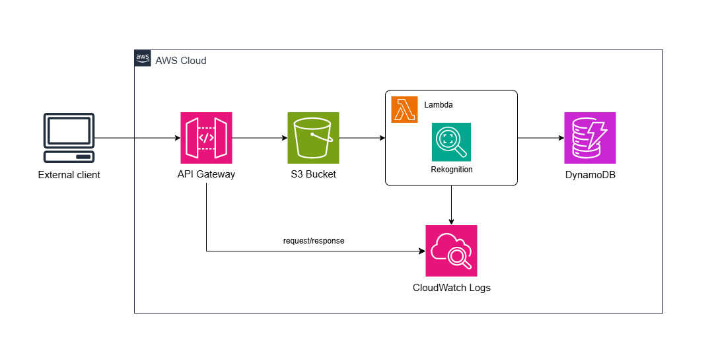

# **ISBN data repository using image analysis and NoSQL storage services in AWS**

_**Technology stack**: Python 3.12, `boto3`, Google Books API_ \
_**AWS services**: IAM, API Gateway, S3, Lambda, Amazon Rekognition, CloudWatch, DynamoDB_ \
_**IaC framework**: AWS Cloud Development Kit_

## Abstract

The following program fetches relevant book data from the Google Books API given ISBN numbers which are parsed from images stored in S3, previously sent by users through an API Gateway endpoint, and analyzed in a Lambda Function with Amazon Rekognition support. The related data is processed altogether in Lambda to be structured and later logged into CloudWatch and stored into a DynamoDB table with a transactional format, useful for further analysis and ad hoc querying.

## Deployment

### Requirements

* Latest version of `pip` installed

* Configured AWS CLI profile with administrator permissions

* Node.js 20.x or later installed (check current [Node.js versions supported by AWS CDK](https://docs.aws.amazon.com/cdk/v2/guide/node-versions.html))

* AWS CDK v2 `npm` package installed

* CDK bootstrapped in the AWS account, done by running:
    ``` bash
    cdk bootstrap [--profile PROFILE_NAME]
    ```

#

### Guideline

Before deploying the project, dependencies have to be installed globally or locally in a virtual environment placed in the root directory which has to be activated. To manage the stack without changing internal project settings, run CDK-related commands inside the `src/` directory which contains the already configured source files. Example for Unix-based shells:

``` bash
python -m venv venv
source venv/bin/activate # PowerShell command: venv/Scripts/Activate.ps1
pip install -r requirements.txt
```
``` bash
cd src
```

Basic deployment settings can be configured in `config.conf` before deploying the stack which include:

* `s3Options`
    * **bucketName**: The name of the stack's S3 bucket. Default: cdk-isbn-analyzer-images
    * **expirationDays**: The remaining days before automatic deletion of files uploaded to the stack's S3 bucket, expressed as an integer greater than 0. Default: 30
    * **transitionDays**: The remaining days before automatic transitioning of files uploaded to the stack's S3 bucket to the Glacier Instant Retrieval storage class, expressed as an integer greater than 0. Transitioning can be optionally avoided by setting a value of 0 or setting a value greater than expirationDays. Default: 14
* `storagePolicies`
    * **removalPolicy**: The type of RemovalPolicy for storage-related resources including S3 and DynamoDB, which can be either DESTROY to totally delete these resources after stack destruction, recommended for testing or development purposes, or RETAIN to preserve them. Default: DESTROY
* `deployOptions`
    * **region**: The AWS code of the region in which the stack will be deployed. Default: us-east-1

Preview the CloudFormation template and deploy the project to the cloud by running:

``` bash
cdk synth
cdk deploy
```

Delete the project and all of its AWS resources and logs (review removalPolicy) by running:
``` bash
cdk destroy
```

Additionally, include the `--profile PROFILE_NAME` flag in case of having configured a specific AWS CLI profile.

## Architecture



#

### Integration

The stack includes an API Gateway REST API by which users can send .jpg or .png images using the HTTP PUT method along with a Content-Type header —`image/jpeg` or `image/png`—, uploading as binary data, and specifying the file name and extension in the `filename` query parameter. The images must be uploaded to the `analyze` endpoint of the API's URL as in the following example using cURL:

``` bash
curl -X PUT "https://id.region.amazonaws.com/v1/analyze?filename=example.jpg" \ 
     -H "Content-Type: image/jpeg" \
     --data-binary "example.jpg"
```

The source name of the images can differ from the name assigned in the `filename` parameter, but the file extension should be identical and included to facilitate filtering files and visualization in S3.

The REST API has a request validator, configured S3 integration, and sufficient CloudWatch permissions to log each request and response into a Log Group. The integrated S3 responses include 200 and 400 status codes and apply JSON content types. Optional configurations can be set up for the S3 bucket using the `config.conf` file such as bucket name and S3 Lifecycle Rules.

The S3 bucket is configured as an event source that triggers a Lambda function which uses Amazon Rekognition as a `boto3` client to detect text from the uploaded images. This Lambda function has a Python 3.12 runtime, a five-second timeout to allow API retrieval, and basic execution permissions —including CloudWatch logging—, Rekognition access, and minimal read and write policies attached. 

Digits are extracted from the first line detected by the Rekognition client and are joined together into a single string. The Lambda handler calls the `utils.py` module in order to use the parsed ISBN number to make a request to the Google Books API using `urllib` and reformat the JSON response with relevant fields and friendly column names. The resulting object has the following format:

``` jsonc
{
    "isbn": "str",          // ISBN-13 identifier, where ISBN-10 is allowed if there are no matches
    "authors": "array",     // Array of authors
    "title": "str",         // Full title of the book
    "categories": "array",  // Array of category names
    "page_count": "int",    // Integer representing the number of pages
    "language": "str",      // Two-character upper string representing the language
    "publisher": "str",     // Name of the publisher company
    "year": "int",          // Four-digit number representing the publication year
    "exception": "int",     // Binary digit to indicate whether the book was found (0) or not (1)
    "timestamp": "str"      // UTC timestamp of the S3 event
}
```

The JSON object is then uploaded by the same Lambda function into a previously created DynamoDB table with provisioned settings, namely 1 RCU and 2 WCU. The partition key of the **isbn-events** table is the 'isbn' field but since data from equal ISBN numbers can be requested multiple times, the 'timestamp' field is set as the table's sort key, making the table act as a fact table by having a primary key composed by a unique asset identifier and a timestamp. ISBN request events can be later queried and grouped to retrieve desired data or identify exceptions through the 'exception' field (i.e., no matching results within the Google Books API).

#

### Testing

Lambda scripts are tested with `unittest` and mocking features. Run the tests package by executing the following command at the root directory of the project:

``` bash
python -m tests
```

Manual testing is encouraged for the deployed CDK stack by adding three image examples of possible inputs expected by the application in the `img/` directory. Images can be uploaded using cURL or through an API testing tool (e.g., Postman), and the results of each operation can be audited through CloudWatch Logs and reviewing the DynamoDB table items.

## Repository

```
cdk-isbn-analyzer/
│
├── docs/                  # Files related to the project's documentation
│   ├── diagram.png        # Draw.io diagram for AWS architecture basic visualization
│
├── img/                   # Example image files to manually test the CDK stack
│
├── src/                   # Source files for the application
│   ├── cdk/               # Package related to the CDK stack
│   ├── scripts/           # Package related to Lambda scripts
│   ├── app.py             # Application file to be referenced by CDK
│   ├── cdk.json           # CDK configuration file with execution, tags, and context attributes
│   ├── config.conf        # Configuration file for setting up options within the stack
│
├── tests/                 # Package of tests for Lambda scripts
│
├── README.md              # Project overview, instructions, and architecture details
├── LICENSE                # License information for the repository
├── .gitignore             # Files and directories to be ignored by Git
└── requirements.txt       # Project dependencies to be installed using pip
```